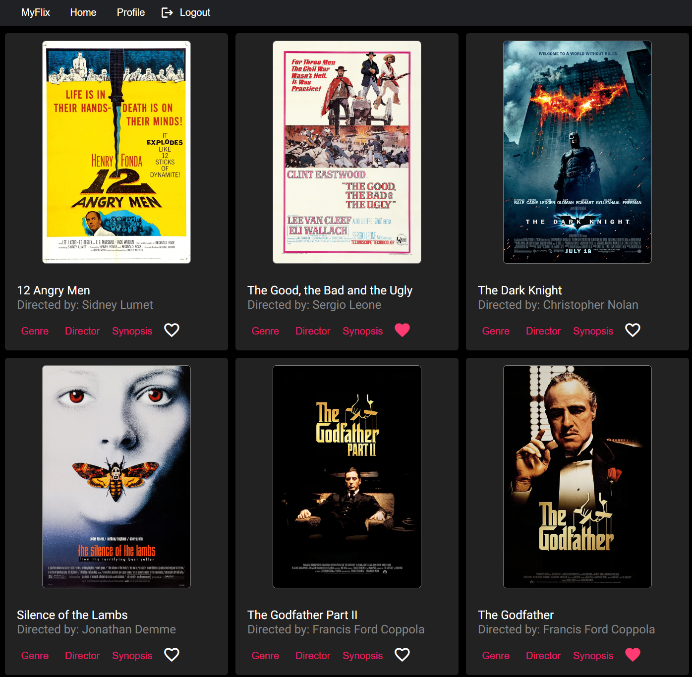

# MyFlix Angular Client Application

## Project Overview

[MyFlix](https://ecspecial.github.io/myFlix-Angular-client/welcome) client application is a single-page, client-side solution designed to display user and movie information. 
It relies on a MongoDB database containing relevant data on users and movies, and utilizes custom made [API](https://github.com/ecspecial/movie-api-aws).

Previous [API release](https://github.com/ecspecial/Movie_API).

## MyFlix Client Application Description
The MyFlix client-side application, developed using Angular, is a responsive single-page app featuring rich interactions, various interface views, and an optimized user experience. It supports the existing server-side API by handling user requests and rendering server-side responses through multiple interface views. The primary objective of this application is to demonstrate a professionally developed frontend in React for a full-stack application.

## Local Development with Angular CLI

Run `ng serve` for a dev server. Navigate to `http://localhost:4200/`. The application will automatically reload if you change any of the source files.

## Code scaffolding

Run `ng generate component component-name` to generate a new component. You can also use `ng generate directive|pipe|service|class|guard|interface|enum|module`.

## Build

Run `ng build` to build the project. The build artifacts will be stored in the `dist/` directory.

## Running unit tests

Run `ng test` to execute the unit tests via [Karma](https://karma-runner.github.io).

## Running end-to-end tests

Run `ng e2e` to execute the end-to-end tests via a platform of your choice. To use this command, you need to first add a package that implements end-to-end testing capabilities.